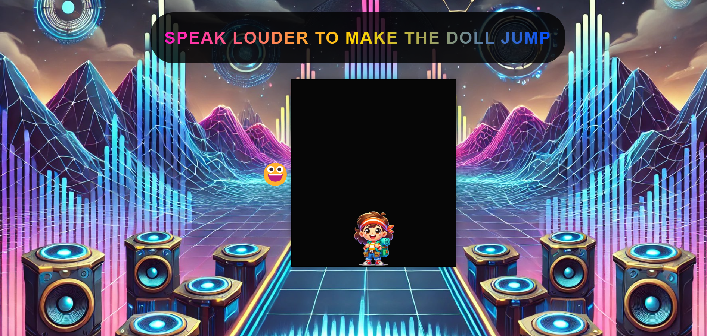

# 🎤 Jump with Your Voice 🚀

Welcome to **Jump with Your Voice**, an interactive game where your voice controls the movement! The louder you speak, the higher the character jumps! 🗣️🎮

👉 [Click here to play now](https://miriametel.github.io/volume-reactive/)

## 🌟 Features

- **Voice-Controlled Jumping** – The character jumps based on your voice volume.
- **Dynamic Emoji Reactions** – The emoji changes expressions based on the detected sound level.
- **Engaging Visuals** – A beautifully designed background with smooth animations.

## 🎯 How to Play

1. **Allow microphone access** when prompted.
2. **Speak or shout** to make the character jump.
3. **Try different voice levels** to control the jump height.
4. Have fun and challenge yourself to jump as high as possible! 🎤🏆

## 🛠️ Technologies Used

This project was built using:

- **HTML, CSS, and JavaScript** for the game structure and styling.
- **Web Audio API** for real-time voice detection and volume measurement.
- **GitHub Pages** for hosting the game online.\*\*

## 🛠️ Installation & Setup

1. Clone this repository:
   ```sh
   git clone https://github.com/MiriamEtel/volume-reactive-game.git
   ```
2. Navigate into the project directory:
   ```sh
   cd volume-reactive-game
   ```
3. Open `index.html` in a browser and start playing!

## 🎮 Play Online

🔗 **[Click here to play the game](https://miriametel.github.io/volume-reactive-game/)**

## 📸 Screenshots




## ⭐ Support the Project

If you enjoyed the project, give it a ⭐ on GitHub to support it!

## 🤝 Contribute to the Code

We welcome code contributions! You can submit pull requests or report bugs to improve the project.


📢 **Have fun and enjoy the game!** 🎤🚀

